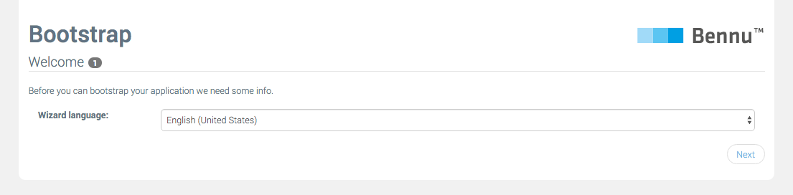
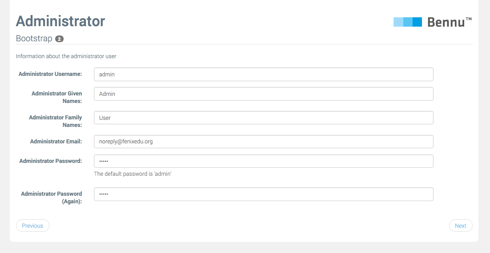
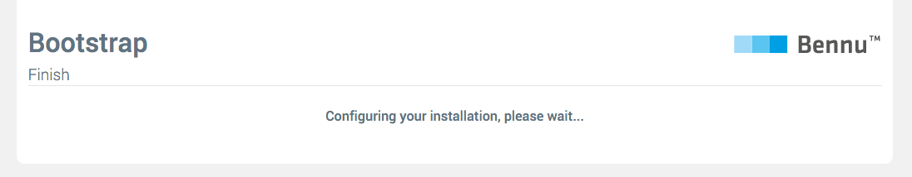

# [Application Bootstrap](README.md)

When a newly installed Bennu application first runs, instead of its regular web interface, it will display a wizard that will help you configure your application.

An exception to this, is where as a part of your application, you have a startup script that automatically configures it.

**Implementation note**: The system chooses to present the bootstrap wizard when there are no configured users. This means that if a startup script creates a user, it may leave other data inconsistent. Be careful when creating such scripts.

## Bootstrapping your application

After installing your application, open it in your browser. You will see the Bootstrap's welcome screen. The first step in the wizard lets you choose the language to use for the wizard.

Then, you need to configure the details about the 'Administrator' user. This user will have full permission to manage the system. Every field will have a default value. You can use these if you want, but this is highly discouraged when configuring a production instance.

When you are satisfied with the value of every field, you need to click the Next button to advance to the next step. The exact number and sequence of steps depends on the modules installed on your application.

After you've completed all the steps, you will see a Submit button instead. Click it to finish the process.

After configuration is finished, you will be redirected to the application's root, where it will behave as normal.

**Bootstrap Access**
~~~
As the user and groups system is not yet initialized during the bootstrap process, everyone with access to the application will be able to set it up, including defining the 'Administrator' user. Ensure that access to your application is limited until the bootstrap process is finished.
~~~

## Writing a custom Bootstrapper
Application modules may also require some basic configuration to work properly. Bennu provides a way to add bootstrap 'steps' in a modular way.

If you need some bootstrap configuration in your module, the following steps will guide you it:

1. Create a class in your module, annotated with @Bootstrapper. Here you will specify the name of your module (by providing a Resource Bundle and a key containing the actual name), and list all the sections that must be presented to the user.
2. Create an interface annotated with @Section, once again giving a proper name to be presented to the user. In this interface, you can add methods annotated with @Field. Each of these methods will be rendered as either a text field, password field, email field or select box (with a set of provided options), and then made available to your code once the bootstrap process is triggered by the user.
3. Create a static method in your class, annotated with @Bootstrap. This method may receive instances of your section interfaces, whose method return values will correspond to the values added by the user. In this method, you can perform your configuration, or return an error if any of the arguments is missing or invalid. To do this, you must simply return a list of BootstrapError instances, which will be converted into proper error messages for the user. If either of the bootstrap methods fails, the whole bootstrap process will be aborted, and later retried.

For a more detailed list of possible configurations for @Bootstrapper , @Section and @Field, refer to their individual Javadoc.