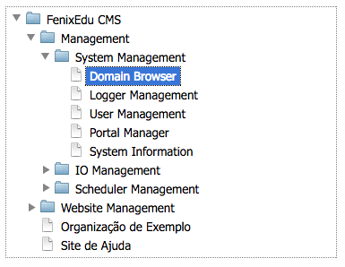

## [Functionality Tree](functionality-tree.md)

Bennu Portal allows applications to have a dynamic menu, depending on the set of modules installed in the application.

The functionality tree has a static Root node, that is always named after the application, and cannot be managed the same as other nodes.

Every node in the tree (be it a container or a functionality) always has the following properties: title, description, semantic path, visibility modifier, custom layout, icon and access group.

Whereas most of the properties of a node can be changed after its creation, two main ones are immutable on creation: the node's parent and the semantic path (although the order of the node within its siblings can be changed). This allows for a node to always have a consistent full semantic path, which plays a great part in achieving the performance characteristics that make Portal lightweight. For more information on how the semantic routing is handled, check the Semantic Path Routing section below.

## Containers

Containers are the Functionality Tree's internal nodes. They aggregate child nodes (either other containers or functionalities). A layout specified at a container level will be propagated to its children (unless they override the setting by providing a custom value). The container's access group will be used to determine whether a user can access the fragment of the tree under the container.

When installing Applications or Functionalities (which will typically be auto-discovered by analyzing the code's metadata), they must always be placed under a container (including the Root container). Installing an Application will create a sub-container with the application's name and the functionalities underneath it, whereas installing a functionality will install it directly under the container.

## Functionalities
Functionalities are the tree's leafs. They represent the actual application's functionalities that the user interacts with. The access to a functionality is determined by checking the membership of all the access groups in the path to the tree's root node.

For Portal's router to know what to do when a functionality is requested by its semantic path, each functionality must be associated with a portal backend, and have a unique key, so the backend can know what to show the end user.

## Semantic Path Routing
Portal allows for functionalities to be referred to by their semantic paths. Each node in the functionality tree has a semantic path fragment, which identifies it among its siblings. By joining the semantic paths of all the nodes in the path to the tree's root, you get the full URL for a given node.

When a request arrives, every component of the URL is compared against the functionality tree's semantic path fragments. Starting with the Root node, every component is matched against the URL of every children, until one is found (or not, in which case the system gives up this search), passing the search along to the found node.

If the last node in the path is a container, the system will look up the first child functionality to which the user has access to. This means that the ordering of the nodes within the tree is very important.