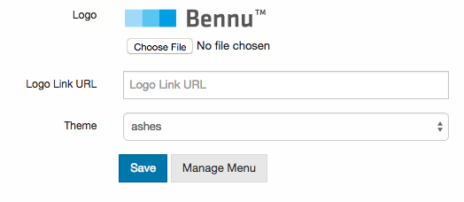

# [Using Bennu Portal](using-bennu-portal.md)
There are two main components required to deploy a successful Portal Application. You must choose a [Theme](../portal-themes/portal-themes.md), and configure the application's [Functionality Tree](../functionality-tree/functionality-tree.md).

After finishing the Bootstrap process on a new installation, a branch will be installed in the functionality tree: [the Bennu Admin Application](../../../../bennu-admin/docs/bennu-admin/bennu-admin.md). In Bennu Admin, you can select the application's theme, and manage the functionality tree.

## Choosing a Theme
When building your final application, you must include your desired themes as a dependency in your Maven/Gradle project. On startup, Bennu Portal will detect all the available themes, and show them in the Bennu Admin application.

Changing Themes is as simple as opening the 'Portal Management' functionality in Bennu Admin, and choosing the theme from the dropdown menu:

