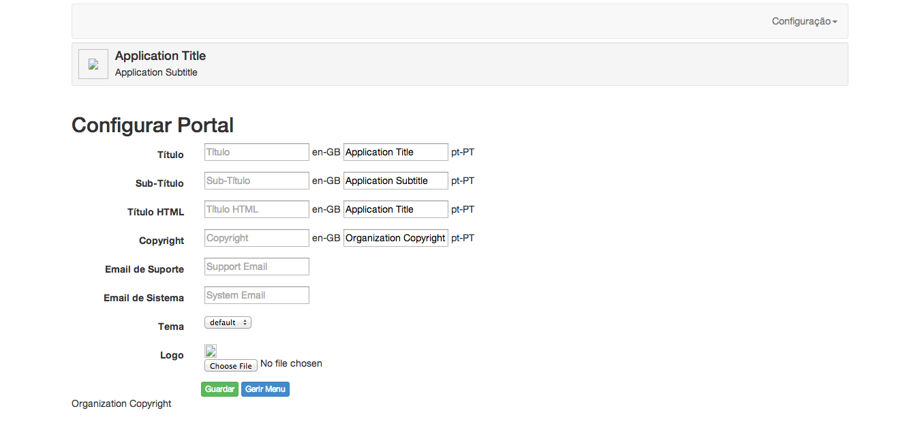
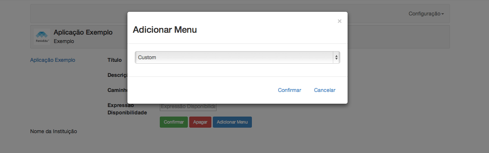
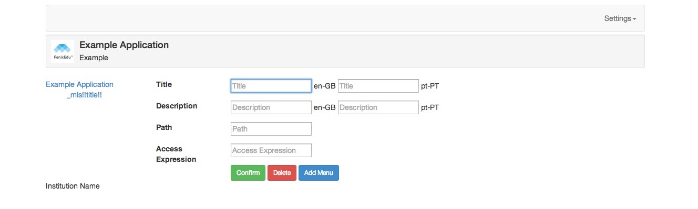
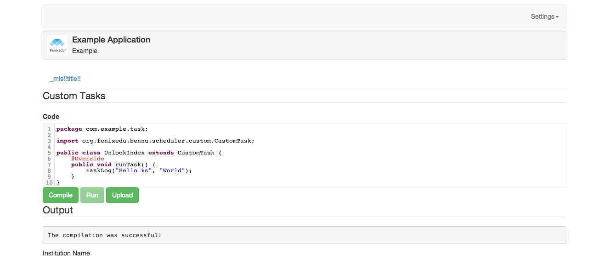

# Bennu Framework User Documentation

## Getting Started

Upon the first run of a Bennu application over a clean database the system will initialize everything necessary to the administrator's login. On an installation with no users anything will be accepted as login, and that login will create an administrator account.

## Installation Customization

In ```https://example.domain/bennu-admin``` the administrator can configure the basic settings of the application, namely: application title, application subtitle (optional), html title, copyright information, support email, system sender email, application logo, and theme.



## Menu Configuration

From ```https://example.domain/bennu-admin``` select Manage Menu button. The root menu node is visible, select it and click Add Menu, select the functionality to insert and click Confirm.



Besides the functionalities present in the installation the administrator can also add a custom link, setting manually the name, the url and the access expression.



## IO Configuration

From ```https://example.domain/bennu-io-ui``` the administrator can create file storages. File storages are locations on which the system can save the byte content of your application's domain linked files. There are two types of file storages: Domain and LocalFileSystem, the first saves the byte content in the database as a domain instance, the latter under a path on a server accessible file system.

To create a Domain storage select that option and fill in a name like: db-storage1.

To create a LocalFileSystem storage select that option and fill in a semantic name like before, a server accessible path, and the 'Directory Indexing characters' parameter. On the server accessibe path anything in the form: ```{x}``` will be replaced with the system property x. The Directory Indexing characters mystical parameter is a split threshold over the characters of the file unique id, setting the path hierarchy of the file, for example, with 3 in the parameter and a unique id of 12345678 the file will end up in: url/123/456/78/.

After setting the storages access ```https://example.domain/bennu-io-ui/#configuration``` and for each file type set on which storage they will end up. (Don't forget the save in the bottom)

## Scheduler

In ```https://example.domain/bennu-scheduler-ui``` the administrator can scheduler any available task to run periodicaly of once as soon as possible. Any output, errors and the execution log is loaded dynamically.

For once as soon as possible click Run Now. For periodically click Schedule and set a crontab expression defining the periodicity. For reference over crontab format go here [http://en.wikipedia.org/wiki/Cron](http://en.wikipedia.org/wiki/Cron).

### Custom Tasks

In ```https://example.domain/bennu-scheduler-ui/#custom``` the administrator can run any piece of code that compiles over the applications codebase. Click Add Custom Task and paste your code in the editor, then click Compile, if successful the Run button will enable, click it to run. Alternalively you can just upload a file with the source.



This feature is just as powerful as it is dangerous, use with caution.
