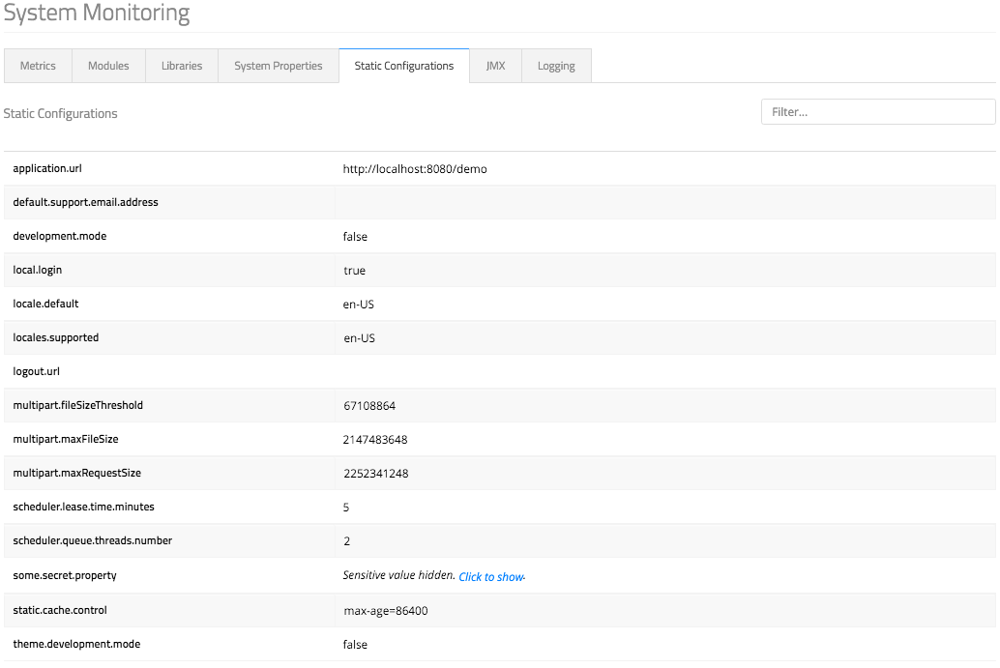
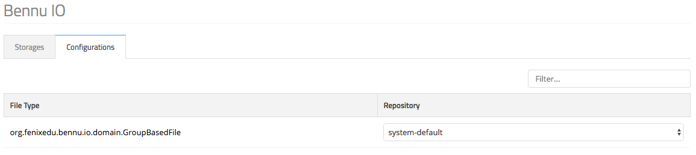
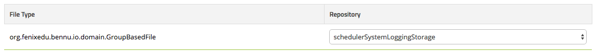

# [Bennu Admin](./bennu-admin.md)
Bennu Admin is a module that provides user interfaces for managing a Bennu-based application. It provides system monitoring functionality, user management, file storage management, portal management, scheduler management and a domain browser.

+ System Monitoring
    + Metrics
    + Modules
    + Libraries
    + System Properties
    + Static Configurations
    + JMX
    + Logging
+ Domain Browser
+ File Storage
  + Store Management
  + File Association
+ Portal
  + Portal Configuration
  + Menu Configuration
+ User Management
  + User Search
  + User Management
  + User Creation
  + Dynamic Group Management
+ Scheduler
  + Task Logs
  +  Tasks
  + Schedules
  + Custom Tasks

## System Monitoring
This section provides you with an overall view of the state of your application instance.

### Metrics
This section shows you the state of the host and JVM your application is running on.

Here you can see memory information (such as Heap and Metaspace occupancy), CPU usage information, statistics about the JVM itself (name, thread count, loaded/unloaded classes, startup time, uptime) and GC information.

Clicking on the + Info button in the memory section shows you details about the memory usage on the multiple pools (Eden, OldGen, Metaspace, etc).

 

Clicking on the Healthchecks button, the system will run all the configured health checks, and show a status report of all of them, including how long each one took.

  

The Thread Dump option will return a view of all the running threads in the application, allowing for filtering by state and by name.

  

The Full GC button will manually trigger a Full Garbage Collector cycle. Beware when running this in a production instance, as it may cause a long GC pause (up to several minutes) during which the application will be unresponsive.

### Modules
This tab will list all the installed Fenix Framework modules and their respective versions.

  

### Libraries

Here are listed all the libraries (i.e. JAR files) used by the application. Due to the JAR manifest attributes not being completely standardized, some will be missing in the interface. For that reason, the name and checksum of each JAR will be shown.

  

### System Properties

This screen shows all the system and environment properties of the JVM running the application.

### Static Configurations

Here all the properties defined in the configuration.properties file are displayed. Due to the sensitive nature of some of these properties, their value may be hidden by default. To show it, one must simply click the 'Click to show' button.

### JMX
This section will list the attributes of all [JMX](http://www.oracle.com/technetwork/articles/java/javamanagement-140525.html) beans on the running application. It starts by showing all domains of the registered beans. Upon expanding a domain, one can view each bean under that domain, filter the beans, and view the attributes of each bean.

### Logging

It may be necessary to dynamically change the log level of a given Logback logger. This interface allows you to do just that, listing all the loggers currently registered in the system, providing the option to individually adjust the log level for each one of them.

As Logback implements the Log Levels in a tree structure, changing the level for an internal node (i.e. a logger with child loggers) will change the level for all its children without a defined level.

Consider the following example: If logger org.fenixedu.foo declares a level of DEBUG, changing the log level of org.fenixedu will automatically change the level of all org.fenixedu.* loggers, except for the org.fenixedu.foo logger.

## Domain Browser

The Domain Browser functionality allows you to traverse the application's object graph, displaying all the stored properties and relations for a given object. This is extremely useful when trying to debug a live system, or trying to manually extract some piece of information that could otherwise be too hard to reach.

The Browser always starts from the DomainRoot object, allowing the whole object graph to be traversed from there, and allows viewing any specific object by providing its External ID.

The picture shows an example of the view for an individual object. On the top it has the object's concrete class name, the object's External ID, and any visibility modifiers the class may have.

Next, a table containing the names, values, types and modifiers of the object's properties and to-one relations is shown. Clicking on an object reference in a to-one relation will navigate to it.

The final table contains all to-many relations the object may have. Clicking on the Load button next to the name of a relation will load the object count in that relation, and display it on the screen.

Clicking on the relation's name on a to-many relation will load the relation's contents and display them in a modal, as shown above. Same as the to-one relations, clicking on an object within this modal will navigate to it.

## File Storage

Bennu IO provides the necessary infrastructure for transactionally storing arbitrary files.

This interfaces allows you to configure the location in which the files will be stored.

### Store Management

The main interface will list all the File Storages currently configured in the system, and report the number of files stored in them. From this screen you can change the default storage (the one that will be used when no other specific storage is configured for a given file type), and delete an empty storage.

You can also create new storages by clicking the New button. This will open an interface that will allow you to choose between creating a Domain-backed storage (in which the actual contents of the files will be stored in domain objects in the database - beware when using this with large files. MySQL Databases are not the best blob stores out there) and a File System storage (which will store the files as actual files in a hopefully-distributed file system. This is the recommended option for most production scenarios).

To create a Domain Store you must only specify a unique name for it, whereas to create a File System store you must also specify a path in the local file system, and the default length to be used when creating the folder names for the directory tree (for most cases the default value will suffice).

If you want to create a file storage of a different type, you will need to either the interface provided by that specific storage integration module, or via a Custom Task.

### File Association

Bennu IO allows configuring which File Storage is to be used for new instances of each file by file type (i.e. it allows configuring that a given File Storage is to be used for every new instance of a file of a given type).

The Configuration tab lists all the current file associations.

To change the association for a given file type, you simply choose the new storage in the select box for that type. You will get visual feedback upon a successful save.

## Portal

Here you can manage the configuration of your Bennu Portal instance.

### Portal Configuration
The default page when entering the Portal Configuration will allow you to configure multiple properties about your application:

### Menu Configuration

Clicking the Manage Menu button will allow you to manage the functionality tree of your application.

Selecting a node in the tree will allow you to set its basic information (title, description, layout, icon, visibility and access expression), delete it, or move it (only within its siblings).

If the selected item is a Container (visually indicated by a folder), you may manually create a Child folder (for organization purposes), or install an application or functionality under it. To do so, click the Install button, and the following modal will be shown:

Here you can select the application you wish to install, and click Install Application to install it. If you only want to install a single functionality, start by selecting the application it belongs to, then select the functionality from the select box, and click Install Functionality.

## User Management

The User Management interface allows search for users, creating new users and managing existing ones. It also allows managing the members of the system's dynamic groups.

### User Search

The main screen of the User Management interface allows you to search for any user in your application by name or username.

### User Management

Clicking the Manage button on any individual user will show an interface where you can edit some of the user's basic properties: Name, Email, Preferred Locale, Password Reset, Expiration Date and Avatar.

### User Creation

You can use Bennu Admin to create a new user in the system. To do so, click the Create User button in the main User Management interface. The following interface will be shown:

To create the user, you must set all the properties but the expiration, if you wish the desired user to have an unlimited login validity. After the user is successfully created, you will be redirected to the user edition interface, where you can view the username that was automatically assigned to the user.

### Dynamic Group Management

To manage dynamic groups, you need to enter the main User Management interface, and click the Groups button.

Here you can see a list of all the dynamic groups that are persistent in the database. Note that due to the way Dynamic Groups work, this does not mean all possible groups are shown here, only the ones with an actual group defined.

Selecting a group on the left allows you to manage it. From here, you can list all users on that group, remove existing users, add new users, and specify a Custom Name for the group.

## Scheduler
Bennu Admin provides the interface to fully manage the Scheduler.

The interface shows you the main options (details below), and allows general configuration of the Scheduler system. Clicking the cogwheel will open the following menu:

Here you can configure the File Storage that the Scheduler will use to store its logs (assuming you are using the default, file-based logging repository), download a JSON file with all the schedules, restore schedules from a file, and delete all existing schedules. This may be useful if you need to temporarily disable the Scheduler, or want to backup the existing schedules.

### Task Logs

The Task Logs tab shows you the details of the last execution of a specific task: the task name, when it started, when it ended and whether it was successful or not. Custom Tasks will be clearly identified, so they can be distinguished from regularly-scheduled tasks). From this view you can find any task by name or execution date.

If you click the More button on a given task, you can find more executions of that same task:

Clicking on the Details button on either view you show you the details about the selected execution. The level of detail will vary depending on whether the task in question was a Custom Task.

This view shows the name of the task, the unique identifier associated with the execution, the execution times, the state, hostname of the application server that ran the task, any log messages written by the task, the task's stack trace, and the list of files written by the task.

When viewing the details of a Custom Task, you will also be able to see the username of whomever ran the task, as well as the task's code.

### Tasks

The Tasks tab shows you all the scheduleable tasks present in the application's code. From here you can pick a task to 'Run Now', or schedule a task to run at a designated time pattern.

Clicking the Schedule option will allow you to specify a cron-like pattern that will determine when your task will run. You can find the [pattern reference in this link](http://www.sauronsoftware.it/projects/cron4j/manual.php#p02). After you create the schedule, the task will immediately be illegible for running.

### Schedules

The Schedules tab lists all the currently configured scheduled patterns. Note that due to the limitations of the pattern system, you may find multiple entries here for the same task.

Clicking the Logs option in a schedule will show you the execution logs for the associated task, and clicking the Delete option deletes the schedule.

### Custom Tasks
The New Custom Task tab allows you to write the Java code of a Custom Task to be run.

Before any code is run, it must be compiled to ensure it follows Java's syntax and semantics. If the compilation if successful, you may click the Run button to actually run the task.

