# [Messaging](README.md)

The Messaging module provides an infrastructure and interface to facilitate email-based institutional messaging between application user groups.

The infrastructure provided by the module includes:

+ A Message class representing localizable messages with an email-like structure that stores content, recipient and other email related data.
+ A Sender class representing an email sending entity associated to an email address
+ Modular email dispatching mechanism along with a standard email dispatcher module
+ Tasks to automate message dispatching and deletion
+ Sender and Message creation API
+ Group-based access management of interface functionalities
+ Interface editable templates for API message sending

The interface enables regular users to:

+ Consult the message history and configuration of the senders they have access to
+ Send messages through those same senders
+ Delete their own messages before their dispatch
+ 
and enables application managers to:

+ Create, configure and delete senders
+ Edit message templates
+ 
The following sections will detail the module's key features in detail.

## The Sender Class

The Sender class serves essencially as an email sending configuration and access control mechanism for a given email address.

Its configurations include HTML sending capability, name, default reply-to address, allowed recipient groups and message deletion policy.

Access control is done via a link between senders and a group. Members of this linked group can, via the interface, consult the sender and its past messages as well as send their own. This control is done exclusely in the interface as programmatic use of the sender does not check for logged user membership prior to creating the message. In those circumstances the sender is better viewed as the entity responsible for communicating progress in a given process and the concrete message's creator user as the person responsible for triggering said progress.

When instantiated the MessagingSystem always creates a generic system sender with a bare-bones configuration. When an installer runs the bootstrapper he may reconfigure this sender's address, name and members. It is also configurable through the messaging interface like any other sender. Unlike the others however, it cannot be deleted.

Senders can be created programmatically through the SenderBuilder class. The static method Sender.from(String) provides an instance of SenderBuilder given a valid email address. These builders can be reused to build multiple senders. Each builder contains chainable and easily intelligible methods for setting the corresponding domain object's slots sanely. See the diagram on the side for more detail.

A collection of all senders can be obtained through Sender.all() and a collection of those available to a user through Sender.available(User). Sender.available() is a shorthand for the latter using the currently logged in user.

Sender instances are comparable and their default order is alphabetical by name.

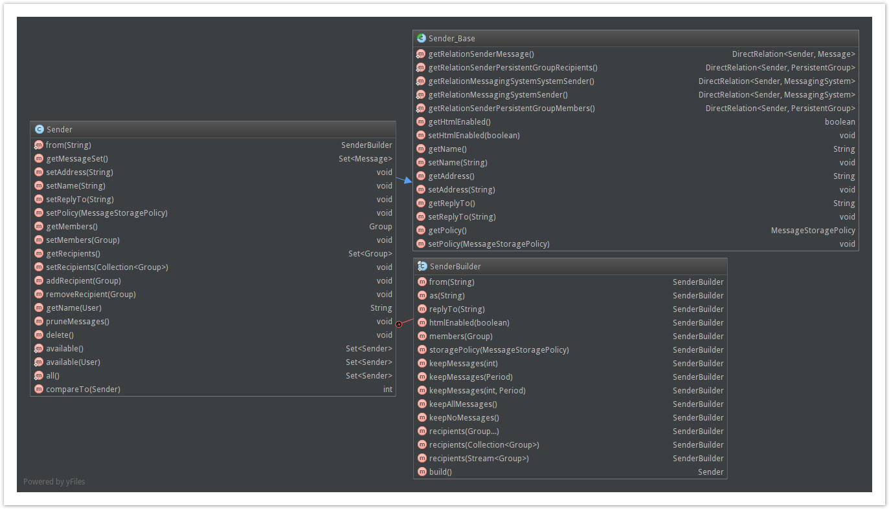


**Sender Creation Example**
```
Sender recruitment = Sender
    .from("recruitment@store.com")
    .as("Recruitment")
    .replyTo("human.resources@store.com")
    .keepAllMessages()
    .members(recruitersGroup)
    .htmlEnabled(true)
    .recipient(applicantsGroup)
    .recipient(employeesGroup)
    .build();
```

## The Message Class

The Message class represents content from a given sender that is to be sent to a set of recipients through email. This content may be available in multiple locales and there may be an arbitrary number of recipients therefore, depending on the dispatcher module's take on locale preferences and SMTP server restrictions, each Message object may actually correspond to multiple MIME Messages.

In parallel with an email, the message content consists of a subject and plain text and HTML versions of a body. It supports several recipient types: Group based Tos, Ccs and Bccs as well as simple email string Bccs. Additionally the message object also has a slot for a reply-to address and a preferred locale.

On creation the message registers its creator, the logged user, and its creation time. It is immediately queued as pending dispatch.

Like Senders, Messages can be created programmatically through a matching builder class. Message.from(Sender), and its system sender shorthand Message.fromSystem(), provide an instance of MessageBuilder given a non null sender. The MessageBuilder class has a similar structure to the SenderBuilder, instances are reusable and it contains chainable and easily readable setters. MessageBuilder delegates some work to a TemplateBuilder if a MessageTemplate is used in the process. More details on this and on MessageTemplates can be found in the next section. The MessageBuilder also has the option to wrap the message with the special institutional message wrapper template. This template's main purpose is to wrap all messages sent by the interface but is also available to be used here so that developers can mimic interface messages programmatically.

Message objects are meant to be kept as records and are therefore immutable through normal means.Their public interface only includes getters so they cannot be changed once created. Also they can only be manually deleted prior to their dispatch by their registered creator, whether programmatically or through the interface. Other than that messages are only meant to be deleted through an automated task in accordance to their sender's record cleaning settings. More details on this subject can be found in the Task Automation section below. Record altering operations, if absolutely necessary, can always be done via reflection or directly within the database.

How Messages are translated into emails and dispatched is left to an auxiliary dispatcher module. The core messaging module only establishes the API to be followed. This API includes a way to consult on the dispatch process' result. More details on this subject can be found in the Dispatcher API section below.

Like senders, messages are comparable and their default order is by descending creation date.

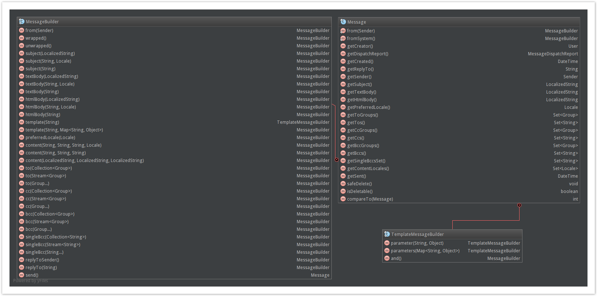


**Message Creation Example**
```
Message saleEndMessage = Message.fromSystem()
    .subject(saleEndSubject)
    .textBody(saleEndText)
    .htmlBody(saleEndHtml)
    .bcc(clientGroup)
    .singleBcc("clients.mail.list@store.com")
    .preferredLocale(Locale.ENGLISH)
    .wrap()
    .send();;
```

```
Message saleEndMessage = Message.fromSystem()
    .template("announcement.store.sale.end")
    .parameter("time", saleEndTime)
    .and()
    .bcc(clientGroup)
    .singleBcc("clients.mail.list@store.com")
    .preferredLocale(Locale.ENGLISH)
    .send();
```

**Message Deletion Example**

```
if(saleEndMessage.isDeletable()){
    saleEndMessage.safeDelete();
}
```


## Message Templates

Message templates facilitate the task of altering and sending systematic messages whose content can be templated based on a set of fixed parameters.

Templates are declared via the annotation DeclareMessageTemplate. This annotation can be attached multiple times to any class. The class itself is irrelevant, you are free to attach each template to the class that makes the most use of it, or group them on a single dedicated class as you prefer. The template declaration contains a template identifier, default template content values, descriptive fields and a bundle field.

Out of these only the identifier field is required as the String used to specify and access the template. Descriptive fields are optional and content fields are required for use but can be filled and edited in production.

The bundle field should be mentioned before the rest since it affects their meaning. It's value should be a property bundle identifier. When present, the other field's values are taken as keys to properties within the specified bundle, otherwise they are taken as the content itself in the application's default locale.

The default template content for subject, plain text body and html body is used to initially populate the template and the template can always be reset back to it.

The descriptive fields can not be changed in production as they are meant to describe the template's and its parameters' intent and usage. The parameter descriptions are done through an auxiliary TemplateParameter annotation, which contains the parameter's identifier, used in the templating itself, and description. The purpose of the descriptive fields is mostly to establish a contract between the developers and the managers that are responsible for costumizing the templates to fit the institution's needs. Beware however that the contract is merely a tool for better communication, it is not strictly enforced.

On servlet context initialization, the template declarations are gathered so they can, on MessagingSystem initialization, be linked to an id matching MessageTemplate domain object or to a newly created one when no match is found. Existing template's content is not automatically overwritten by new declaration defaults, only the descriptive content is automatically updated. Removed declarations do not automatically delete the domain object either, the template simply loses its description and is marked as undeclared. It is possible to re-declare, create or delete templates in production but this is heavily discouraged as it is dangerous and most use cases do not require it. Make sure you have a strong reason before doing it. If you are certain that undeclared templates are not used by the code and wish to clear them off the database you can run the provided DeleteUndeclaredTemplates task.

MessageTemplates can be used in Message sending through their id. The auxiliary class TemplateBuilder used by MessageBuilder receives a key and parameter mappings, compiles each content of the LocalizedString templates and sets it into the appropriate Message slot. The content templating language is [Pebble](http://www.mitchellbosecke.com/pebble).

MessageTemplates are accessible to managers through the interface. The interface section describes their associated actions.

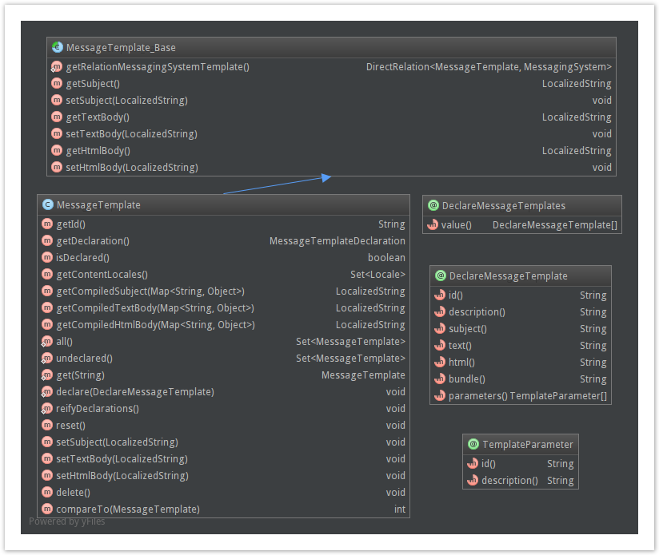


## Dispatcher API and Standard Email Dispatcher

An email dispatch module should contain a class implementing the MessageDispatcher interface and should either set the MessagingSystem's dispatcher to an instance of this class within a ServletContextListener's contextInitialized method or provide a task to do so. Additionally, to implement the MessageDispatcher interface it will be necessary for the module to contain a class extending the MessageDispatchReport abstract class since the interface's message dispatch method must return an instance of it. A MessageDispatchReport object registers the delivery start time, end time and counts of the invalid, failed, delivered to and total email addresses on dispatch. If the dispatcher returns null, the message is not marked as dispatched and will be processed again the next time the task is run.

The bundled email-dispatch module provides a standard e-mail dispatcher using the Java Mail API and MIME style email messages. Beyond the basic dispatch functionality this module offers:

+ A persistent singleton adress black list class, EmailBlacklist, that collects and logs invalid and delivery failed addresses as reported by the email dispatching process.
+ Separation of the Message object translation into individual message handlers from the actual sending of the corresponding MIME messages, allowing a saner transaction model and side effect handling.
+ An task for email sending, the EmailTask, discussed further in the Task Automation section below.
About the bundled module's dispatch functionality, it is important to detail how the Message object may be demultiplexed into multiple MIME Messages based on locale and recipients. The module separates recipients into different emails in accordance to their preferred user locale. There will be at least one for each locale that is contained by the Message object and preferred by a recipient user. For single email bccs and when there is a lack of content in one of the email content fields for a given locale, the Message's preferred locale is used. In addition to this, recipients may be further partitioned into multiple messages if they surpass a given configurable number of max recipients per MIME message. These partitions have the unfortunate result of possibly breaking the Tos and CCs address visibility. As a great slice of institutional communication only makes use of Bcc recipients, the convenience of locale costumized messages was preferred over respecting recipient semantics. In order to use this module safely in cases where address visibility is fundamental it is recommended to only provide message content in one single locale, the institution's accepted common language, and to mind the recipient limit.


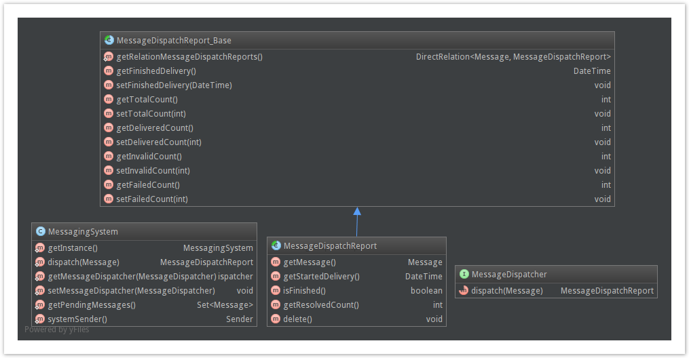


#### **Configuration Properties**

The email-dispatch module expects the following configuration properties:

| **Property** | **Type** | **Default** | **Description** |
|:-:|:-:|:-:|-|
| mail.smtp.host | String | --- | SMTP server hostname |
| mail.smtp.name | String | --- | SMTP server name |
| mail.smtp.port | String | --- | SMTP server port |
| mailSender.max.recipients | Integer | 50 | Maximum number of recipients per MIME Message |
| mailSender.bcc.recipients | Boolean | false | Treat Tos and CCs as Bccs |


### Task Automation

The core project automates message dispatch through a CronTask class, the MessageTask. This task is responsible for the message cycle, performing 2 actions, message pruning and message dispatch.

Message pruning is the deletion of Messages that are no longer necessary according to their sender's MessageStoragePolicy slot. MessageStoragePolicy objects hold the deletion strategy, which can be based on the amount of messages to keep and/or on how long they should be kept.

Message dispatch corresponds to calling the dispatchers dispatch method for all messages marked as pending. The dispatch process is delegated to the MessageDispatcher instance. If the MessagingSystem has no assigned dispatcher, no changes occur. The dispatcher should return a MessageDispatchReport object for each message but can skip messages for a next run by returning null. The core module does not require reports to be complete when they are returned by dispatch. As shown by the email-dispatch module, the message sending and report resolution can be delayed or asynchronous.

The email-dispatch module further divides the process, separating the message sending into 2 steps, the creation of individual MIME message handlers, and their usage for sending the actual MIME messages. The former is done on dispatch, which returns an incomplete report linked to the handlers, while the latter is done through another CronTask, The EmailTask, updating the report as the messages are sent.

These tasks are usually scheduled via the Bennu Scheduler on deployment rather than run manually.


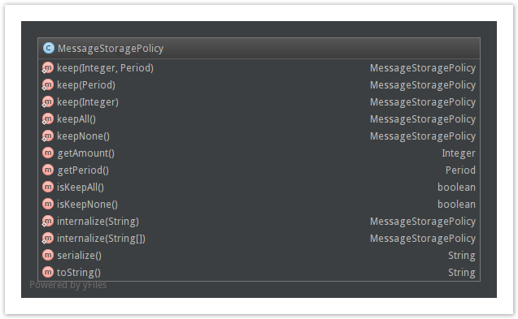


### Other Facilities
The MessagingSystem.Util class exposes the Messaging module's email validation and email list serialization/internalization methods which may be useful to synchronize the whole application's email address treatment.

The Group subclass SendersGroup may come in handy, as it specifies the Group of all users that have access to at least one sender.

The MessageContentBean, MessageBean and SenderBean classes have a public validate() method that validates the bean's matching MessageTemplate/Message/Sender attributes according to interface restrictions. These methods return a String collection containing the messages matching all the found errors.

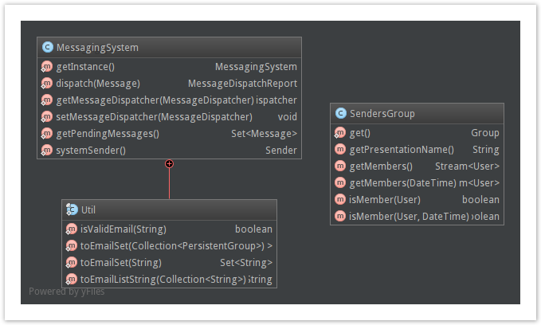


### Messaging Interfaces
The Messaging module introduces a single Spring application titled Messaging System. This application includes 3 functionalities: Message Sending, Sender Configuration and Template Configuration. Message Sending is available to all users that have access to a sender while the other two are accessible only to managers.

For a regular user the Messaging interface is reduced to the Message Sending related pages. The starting page lists the senders available to the user. Directly from the list the user can choose to send a message through a given sender or view his details. On clicking a desired sender, or the view details button, the user is presented with its configuration and sent messages along with their dispatch progress. From there the user can choose to view a past message or send a new one through that sender.

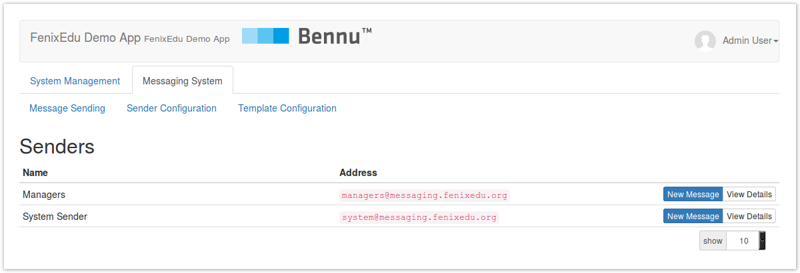


The message view page displays all of the message information and dispatch progress. If the logged user is the message's creator and the message has not yet been dispatched, a delete button will be available on the bottom of the page.

Message sending is limited through the interface, the user does not have access to message templates, as these are mostly intended for automatic use, and only Bcc recipients and addresses are accepted. Group recipients are also limited to the sender's allowed recipients. It's also worth noting that the single bcc field expects comma separated email addresses. Other than that, most fields are pretty straightforwardly mapped to the Message object slots. Messages with empty subject, body or recipients cannot be sent through the interface, an error message on the top of the page will warn the user of this on attempt. On a successful send, the user is redirected to the new message's view page.

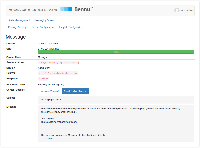


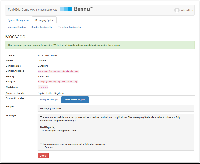


The Sender Configuration and Template Configuration functionalities allow managers to configure these domain entities to fit the institution's needs.

On Sender Configuration, the starting page highlights and details the system sender configuration and lists all other senders. Like with message sending, the page's list provides quick access to sender configuration besides letting the user view the sender's details. The sender view page displays the sender's properties, links to its configuration page and includes a button for its deletion, much like the message view page. The sender configuration and creation pages like message sending is pretty straightforward but some details should be mentioned. The recipient field's content itself is not counted, only the fields below. It's necessary to press the add button for the Bennu Group expression to be counted. In the storage policy field, the amount and period options may be used simultaneously. While the amount is a simple integer, the period field is a period expression (excepting the fixed leading 'P') following the ISO 8601 rules summarized [here](https://en.wikipedia.org/wiki/ISO_8601#Durations).


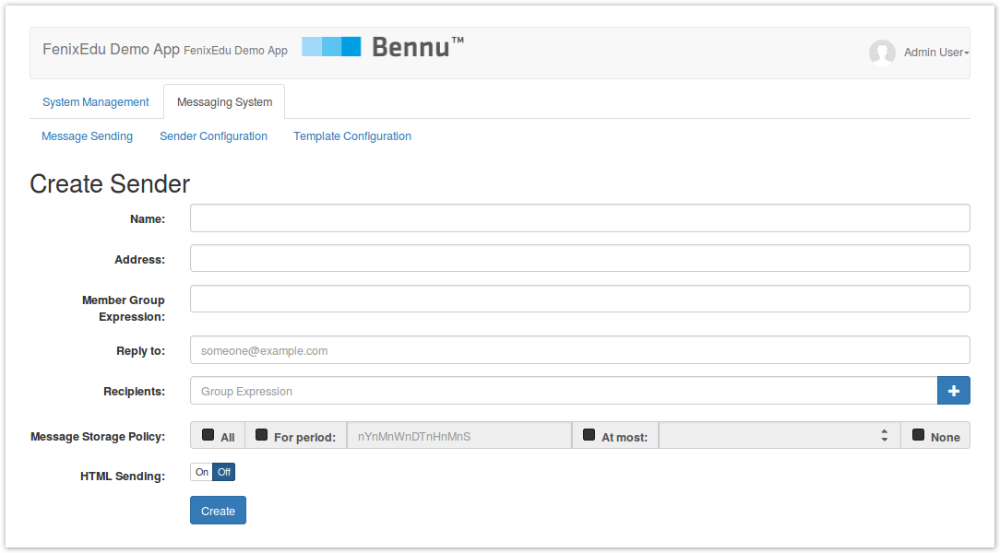


On Template Configuration, the starting page lists all MessageTemplate objects. Empty templates will be highlighted in yellow and undeclared ones in red. Hovering over the highlighted templates will display the matching error message. The page structure is similar to the other's, from the list items you may go directly to the edit page or to the view details page. The view details page lists the template's content and description and links to the edit page. It's not possible to delete the template here on no circunstances. The only remarkable thing about the template edit page is the 'Other Actions' menu, next to the save button. This menu allows to show or hide template descriptions and to fill the fields with the default template content.

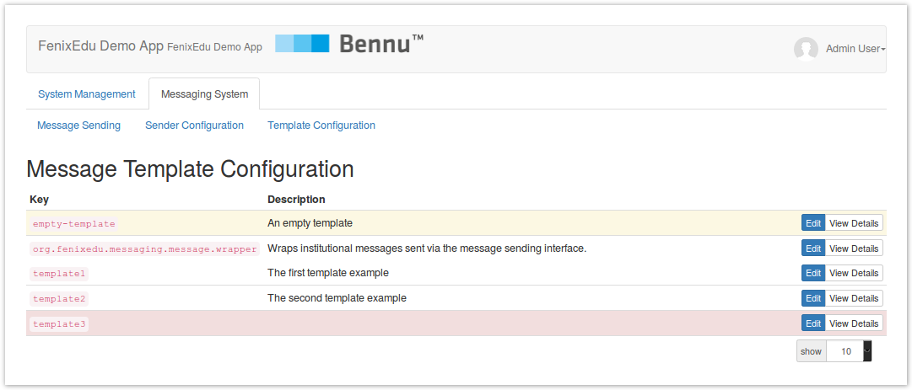


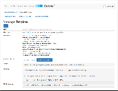


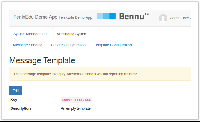

### Deployment Instructions

A manager on first deploying an application that uses Messaging will probably want to go through some if not all of the following steps:

+ Install the Messaging functionality through Bennu Portal management
+ Schedule MessageTask, and EmailTask if using the email-dispatch module, using the Bennu Scheduler
+ If the dispatcher setting is not automated using a ServletContextInitializer, as it is in email-dispatch, you may want to do it by running a CronTask calling the MessagingSystem.setDispatcher(MessageDispatcher) method
+ Create and configure interface accessible Senders, the System Sender in particular if basic configuration on bootstrap is insuficient, through the 'Senders' tab
+ Customize the application's Message Templates, the interface message wrapper template in particular, throught the 'Templates' tab

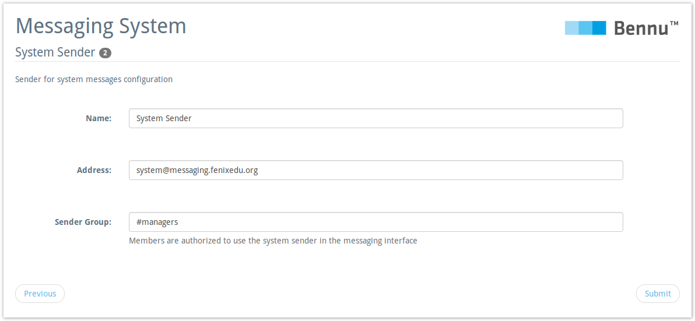
