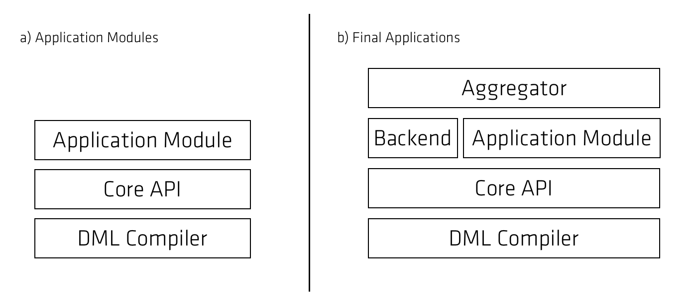

# [Fenix Framework](./fenix-framework.md)

"[Fenix Framework](http://fenix-framework.github.io/) allows the development of Java-based applications that need a transactional and persistent domain model"

+ Domain Modelling Language
  +   Value Types
+ Architecture
  +   Public API
  +   Back-ends
+ Code Generation
+ JVSTM
+ JVSTM/OJB

This chapter describes in detail the major components of the Fenix Framework, which provides core functionality to FenixEdu.

Section Domain Modelling Language describes the Domain Modelling Language, used to describe the application's domain model.

Section Architecture describes the high-level architecture of the Framework, briefly describing its major components and their interaction.

Section Code Generation describes the process of Code Generation.

Section JVSTM presents the Java Versioned STM (JVSTM), and its integration with the Fenix Framework.

Understanding the Fenix Framework is critical for developing with the FenixEdu platform.

## Domain Modelling Language
The Fenix Framework is aimed at enterprise-class applications with a rich domain model in an object-oriented paradigm. Such applications typically consist of class hierarchies representing entities with relationships among them, forming an interconnected graph. 
The Domain Modelling Language (DML) is a Domain-Specific Language designed to represent such domain models, separating the domain's structure from its behaviour. The DML is designed with modularity as a core concern, allowing for incremental and modular domain definition.

In a DML file, programmers write the domain definition in a Java-like language. A class definition consists of the class name, the entity slots (either primitive or value types), and the super class. Listing below shows an example of a simple domain with a User entity. Note that  just like in Java, it is possible to define the visibility of the persistent slots.

```java
public class User {
  public String username;
  public DateTime lastLogin;
  protected String password;
}
```

Relations in DML are named, first-class citizens that represent relationships between two classes. Relations are always bi-directional, meaning that updating one side of the relation will automatically update the other side. Relations can be concealed in one of the sides (meaning that it will not be  possible to access it), however their state is still kept.
It is possible to define **one-to-one**, **one-to-many** and many-to-many relationships, and it is possible to define boundaries on the multiplicity of each relation (for example, a **User** may have anywhere between 0 and 30 **DomainOperationLogs**). Any violation to these constraints would put the relation in an inconsistent state and cause the modification to be discarded.

To-many relations in the Fenix Framework have **Set** semantics, meaning that an object can only be present in a relation once. Also, there are no ordering guarantees when accessing the relation.

```java
relation UserHasExecutedOperations {
  public User playsRole author {
    multiplicity 1..1;
  }
  public DomainOperationLog playsRole operationLog {
    multiplicity *;
  }
}
```

Listing above shows how a relation between a **User** and his records of his operations **DomainOperationLogs**) could be described in the DML. The relation is given a name that describes the relationship between the two classes, as well as names to describe the role each class takes in the relation.
The multiplicity is defined for each of the roles, in this case, one **User** has zero or more **DomainOperationLog**, and one **DomainOperationLog** has between one and one (exactly one) **User**.

From the domain definition, the Fenix Framework generates Java getters and setters for the properties and relations. For each class described in the DML, two Java classes are created: the domain class, in which programmers can include business logic, and a **Base** class (which the domain class extends) containing generated methods to access the persistent entities of the object. The visibility of the generated methods is determined by the visibility declared in the DML.

Consider the DML above.  Below is shown the Code generated for the **User** class and its corresponding base class, as well as the **DomainOperationLog** base class, containing the API generated from the domain definition. For each slot declared in the DML a pair of Getter and Setter  is generated, providing access to the persistent field. For relations there are two types of generated methods, depending on the multiplicity of the relation in the class. For instance, as one **DomainOperationLog** has one **User**, the generated methods are simple getters/setters for the **User**, as if it were a simple slot. On the other side of the relation, as a **User** has multiple DomainOperationLog objects, the generated methods return a Set containing all the elements in the relation. The Framework also generates two methods to add and remove an element  from the Set.

Whereas in the code shown in this document the body of such methods is \texttt{/* Generated */}, the actual code will depend on the backend used in runtime. More details about the Code Generation process are given in Section~\ref{sec:codeGen}.

```java
public class User extends User_Base {
  public User() {
    super();
  }
}
public abstract class User_Base extends
                                       AbstractDomainObject {
  public String getUsername() { /* Generated */ }
  public void setUserame(String value) { /* Generated */ }
  protected String getPassword() { /* Generated */ }
  protected void setPassword(String value) { /* Generated */ }
  (...)
  public Set<DomainOperationLog> getOperationLogSet() { /* Generated */ }
  public void addOperationLog(DomainOperationLog value) {/* Generated */}
  public void removeOperationLog(DomainOperationLog value) {/* Generated */}
}
public abstract class DomainOperationLog_Base extends
                                      AbstractDomainObject {
  public User getAuthor() { /* Generated */ }
  public void setAuthor(User author) { /* Generated */  }
}
```

### Value Types
In the DML there is a distinction between entities and value objects. Whereas an entity is transactional and persistent, a value object is immutable and not persistent. Value objects are used as the values for slots of DML classes, and must be of well-known types, known as Value Types.  A value  type contains information regarding the Java Type (such as **java.math.BigDecimal**), an alias (such as **BigDecimal**), and information regarding how the object will be externalised/internalized.  There are two categories of Value Types: Built-in (Java Primitives and their wrappers, Enums,  JodaTime types, JsonElement, and byte arrays) and user-defined. User-defined types allow the programmer to use any type they wish as a slot, provided the type is immutable (explanation as to why is provided ahead) and can be expressed in terms of other Value Types.

The Framework knows how to handle Built-in Value Types (i.e. how to store/retrieve from persistent support). User-defined, on the other hand, require that the programmer specify how the type is externalised/internalized. The externalised type must be either a Built-in Value Type, or one or more  used-defined types that ultimately externalise to a built-in type.
The Framework provides support to transform any Value Type to/from JSON, meaning that a JsonElement slot is enough to keep any value the Fenix Framework is able to handle.

## Architecture
The main goal of the architecture of the Fenix Framework is to provide a ``write once, run everywhere'' paradigm for applications that have transaction and persistence requirements. The programmer simply writes his application against a public API and is able to run it on multiple back ends. With this architecture, applications are portable across several technologies (MySQL, Neo4j, Hibernate, etc), and are easily testable, by providing a discardable persistence context.

 

Figure below shows the major modules that constitute the Fenix Framework.




The DML Compiler module contains the parser responsible for reading DML files and creating an in-memory description of the Domain Model, as well as all the necessary classes to represent it. It also contains the base **DomainObject** interface, which all objects of the Domain Model  implement. Also present in this module are the base Code Generators used to create the Base classes for all domain objects.

The core of the Framework is in the **Core API** module. Transaction management APIs, configuration, entry points, back-end interfaces, are all defined in this module.

Many backend-independent modules are provided with the Fenix Framework bundle. These include persistent Abstract Data Types (B+Trees, Linked Lists, etc), support for Consistency Predicates, statistics collection tools, indexing and transaction introspection. These modules are used internally by the various back-ends, but can (and in most cases should) also be used by the programmers.


Back ends provide the concrete implementations of transactional and persistence support, and are required for applications to **work**.

### Public API
One of the major advantages of the Fenix Framework is that applications built on top of it are independent of the underlying persistence and transactional backend. However, to guarantee this property, the modules that form such applications must be compiled against the Public API of the Framework.

The public API is split in two major components:


+ **DML Compiler** - Allows applications to have runtime access to the structure of the domain and allows registering relation listeners that will be invoked each time a relation is modified. This module also defines the API that is generated based on the DML, which must be supported by all backends.
+ **Core API** - Provides the entry point for the domain's object graph through the **DomainRoot** class, the mechanism to retrieve a Domain Object from its unique identifier, to validate if a given Domain Object is still valid, transaction APIs that can be used to either mark a piece of code as transactional (@Atomic annotation) or to manually manage the life-cycle of transactions, and utilities to configure the Framework.
 

With this separation, the class-path of the application modules is not polluted with implementation details, allowing for a faster development and test cycle.

### Back-ends
Back-ends are a crucial part of the Fenix Framework. They provide concrete implementations of the transactional and persistence support. Application modules should not depend directly on the back-ends, as their API is private and as such subject to change even among minor versions, and  having a dependency on a specific back-end means that portability must be sacrificed.


The fact that back-ends have a clear separation from the Public API allows for a much faster evolution of the back-end’s implementation. Major internal changes can be done without affecting the end-users directly, even in a revision release, whereas changes to the public API require either a major or minor release.

## Code Generation

As previously described, access to persistent fields of domain objects is done using generated methods in Base classes.

Code generation is closely tied to the specific backends, as it is typically used to support the process of persisting an object to a database. An example of an operation performed in generated code is binding a **PreparedStatement** with the values of the object's slots, or externalizing the object to JSON.

There are two major components in code generation:


+ The default code generator, from which every other generator inherits, defines the public generated API for domain classes. Its major use-case is to compile backend agnostic application modules that only need base classes because of their API (modules aren't bundled with base classes, those are generated on-demand on depending modules or applications).
+ Backend-provided code generators. These generators extend the base ones, thus providing the same API, using backend-specific artifacts to fullfil the API. Backends can also use code generators to optimise runtime performance, by injecting in generated code values that otherwise would have to be computed at runtime.

Whereas this Code Generation architecture allows for great optimizations (it allows backends to perform complex operations without resorting to reflection), it comes with a tradeoff: Forcing the domain classes to inherit from Base classes hinders the readability of the code (as the user is required to either check the DML or the base class to find out the super class), makes it impossible to invoke constructors of the super class (as the Base class only generates the no-arg constructor), does not allow the programmer to choose the visibility of the generated methods (as they are always generated public) among other issues.

The Code Generation step also provides a mechanism to transfer compile-time information to the runtime. Information such as the App Name (which is used at runtime to generate the graph of DML dependencies), the name of the Backend used to compile the final application (to allow for  automatic initialization), as well as pass user-defined parameters to runtime.


## JVSTM
The Java Versioned Software Transactional Memory (JVSTM) is a pure-Java implementation of a Software Transactional Memory.

The JVSTM uses the concept of Versioned Boxes (VBoxes) to make a memory location transactional, keeping the history of values for that position, one for each version of the box. Reads and writes to VBoxes are tracked by the JVSTM in a per-transaction basis.
Each transaction begins at a given moment, acquiring the version number at that moment. The version number is used during the transaction to ensure that all reads get the correct value at the time of the transaction's start, thus providing Opacity guarantees.  This allows for conflict-free read-only transactions, as concurrent transactions writing to the read boxes will write a new version instead of overwriting its previous value.

## JVSTM/OJB
The JVSTM is integrated with the Fenix Framework, as one of the multiple available backends. This document focuses on the backend named **jvstm-ojb**. This is the backend currently used in production. This backend uses the JVSTM for the transactional support, and OJB for persistence.

In this backend, Base classes use a VBox to store the value objects transactionally, thus taking advantage of the JVSTM. The generated getters and setters are backed by **VBox.get()** and **VBox.set()**, and can be invoked only from within a transaction.