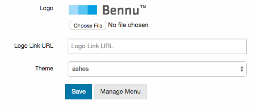

## [Portal Themes](./portal-themes.md)

Bennu Portal provides consistent theming across multiple presentation technologies.

Together with Portal's menu structure, Portal Themes provide a way to coherently structure your web application, even if it is built on top of different web frameworks.

Unlike other frameworks, theming is done in a manner that is agnostic to the underlying presentation technology (be it JSP, Struts, Spring, JSF, etc). Instead

Note that while layout injection is globally activated per-backend, individual requests may

## Choosing a Theme
You can dynamically change the theme of your application. On startup, all the themes in your installation are scanned, and made available for your choosing.

To change your theme, simply open the Bennu Admin application, select 'Portal Management'. You should see an interface similar to the following:

Simply select the desired theme from the checkbox, and hit 'Save'. Your application will now use the selected theme.

## Layouts
A Portal theme contains one or more layouts. All themes are required to provide a 'default' layout (in a 'default.html' file), which will be used to display all functionalities that don't specify any custom layout.

You can choose the layout of a given functionality, or for a whole branch in the functionality tree. To do so, open the Bennu Admin application, select 'Portal Management', and hit the 'Manage Menu' button. Select the tree node for which you want to customize the layout, and insert the name of the desired layout in the provided text field, and hit 'Save'. This will define the layout for the selected menu branch, and all the items below it.

## Portal Theme Contract
To ease the development of Portal-based functionalities, all portal themes must comply with the Portal Theme Contract, which contains a series of assumptions about all Portal themes, giving developers a clear understanding of what is already provided by the infrastructure.

All Portal Themes are required to provide the following:

+ [Bootstrap CSS](http://getbootstrap.com/) (v3.1.0 or upper)
+ [Bootstrap JS](http://getbootstrap.com/)(v3.1.0 or upper)
+ [jQuery](http://jquery.com/) (v1.9 or upper) - Already in Bennu Portal, you must only include it in your markup
+ A default.html file, containing the default layout
+ A style.css file, located in /themes/<theme name>/css/style.css, so that the theme's style may be included in Ad-Hoc pages. This file does not need to be your master CSS file, it may only contain CSS imports for the correct resources.

While not mandatory, the following features are greatly advised for every theme, to ensure a consistent user experience across different themes:

+ The theme should be responsive and mobile-ready.
+ Branding should be consistent across the theme.
+ Bootstrap components should be properly styled according to the theme's own styling.

## Developing your Theme
Developing a Portal theme is fairly straightforward process. Before you start, make sure you are familiarised with the Portal Theme Contract, so that your theme fulfils all its requirements.

While we advise keeping your theme in its own module, there's absolutely no requirement for so, you can include the theme wherever you like.

To make sure the theme is available for the application in runtime, its files must located under /themes/<theme name>. Note that the name of the folder in which the theme is located determines the name of the theme, and it's important that the name be consistent.

As previously stated, Portal themes consist of static resources and layouts.

### Static Resources
Static resources include your theme's CSS, JS files, images, etc. It is advisable to use the build system to generate minified versions of your production CSS and JS (such as using Bootstrap's LESS build and uglify-js).

### Developing Layouts
Portal layouts are simple HTML files, parsed by the [Pebble Templating Engine](http://www.mitchellbosecke.com/pebble/home). Pebble is functionally similar to [Twig](http://twig.sensiolabs.org/), sharing much of its syntax and semantics. Pebble allows for great customisation by allowing the addition of Functions, Filters, Tags. It also allows for easy extension of interfaces, by allowing you to define extension points, that can be overridden in other layouts. For more information about all the features of Pebble, visit its [website](http://www.mitchellbosecke.com/pebble/documentation).

Your layout's HTML files are parsed by Pebble, and the result of this evaluation is printed to the user. Keep in mind that layout injection only occurs when a functionality is selected, and the functionality's backend requires server-side layouting. For more information see Portal Backends.

When templates are evaluated, the following variables are given to the context:

| **Variable Name** | **Type** | **Description** |
|:-:|:-:|:-:|
| loggedUser | org.fenixedu.bennu.core.domain.User | The currently logged User. If the user is not authenticated, this value is null |
| body | java.lang.String | The body of the functionality. This is where the functionality's content is actually kept. |
| functionality | org.fenixedu.bennu.portal.domain.MenuFunctionality | The currently selected functionality. |
| config | org.fenixedu.bennu.portal.domain.PortalConfiguration | The application's PortalConfiguration. |
| contextPath | java.lang.String | This request's context path. Useful to prefix absolute URLs. |
| themePath | java.lang.String | The base URL for this theme. Usage of this variable is not advised, due to its implications when extending themes. |
| devMode | boolean | Whether the application is in development mode. Useful for changing the application's look in development mode. |
| pathFromRoot | java.util.List<org.fenixedu.bennu.portal.domain.MenuItem> | All the MenuItems in the path between the selected functionality and the root of the functionality tree, sorted by depth (i.e. the functionality is the last item in the list). |
| selectedTopLevel | org.fenixedu.bennu.portal.domain.MenuItem | The top-level menu item in the path from the root to the functionality (this is actually the first element of the pathFromRoot variable). |
| locales | java.util.Set<java.util.Locale> | The configured locales for this application. |
| currentLocale | java.util.Locale | The locale for the current user. |
| topLevelMenu | java.util.Stream<org.fenixedu.bennu.portal.domain.MenuItem> | A Stream containing all the items in the Top Level Menu. Due to potential performance improvements, this values returned by this Stream may be cached, requiring a logout to refresh. |

Besides from Pebble's default extensions, Portal defines its own extension, making the following extra functionality available:

#### **Filters**

| **Name** | **Parameters** | **Description** |
|:-:|:-:|:-:|
| base64 | byte[] input | Encodes the given byte array to Base 64 |

#### **Functions**

| **Name** | **Parameters** | **Description** |
|:-:|:-:|:-:|
| i18n | String bundle, String key | Retrieves the given key from the given bundle, as per BundleUtil.getString |

#### **Tests**
| **Name** | **Parameters** | **Description** |
|:-:|:-:|:-:|
| in | Object input, Collection<?> collection | Determines whether the given input is contained in the given collection |

#### **Tags**

| **Name** | **Parameters** | **Description** |
|:-:|:-:|:-:|
| lazyFor | Collection, Array or Stream | Allows iteration over instances of java.util.Stream. Regular collections and arrays are also supported. Unlike Pebble's native for tag, this one only gives access to the current item, and does not allow specification of the else clause. However, it allows for much more efficient iteration over Streams, greatly reducing memory impact. |

#### **Development Mode**
Parsing and processing of Pebble templates is quite an expensive operation. As such, templates are aggressively cached, meaning that live-reloading of themes is not possible by default. To enable this, you must set the theme.development.mode property to true in your configuration.properties file.

#### **Example**
You can find an example of a fully developed, one-column layout, using simple Bootstrap in the [Default Theme](https://github.com/FenixEdu/bennu/tree/v3.3.3/theme/default). This theme uses a LESS compiler to generate the target CSS, and provides a [fully fledged layout](https://github.com/FenixEdu/bennu/blob/v3.3.3/theme/default/src/main/webapp/themes/default/default.html).