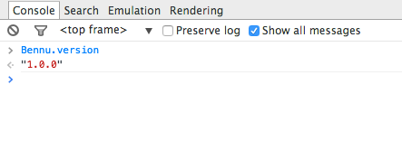

## [**Bennu Object**](README.md)
If you have correctly imported the toolkit, a object called Bennu shoud be available on your window . You can verify if it is loaded by invoking the following on your JavaScript Console:

This object has some information about your application that you can use client side:

| **Poperty** | **Content** | **Example Value** |
|-|-|-|
| Bennu.version | The current toolkit version | "1.0.0" |
| Bennu.username | The username for the correctly logged user | "foobar" |
| Bennu.locales | A list of locales supported by this Bennu installation | [{"tag":"pt-PT","displayName":"português (Portugal)","lang":"pt"},{"tag":"en-GB","displayName":"English (United Kingdom)","lang":"en"}] |
| Bennu.locale | The locale currently being used | {"tag":"en-GB","displayName":"English (United Kingdom)","lang":"en"} |
| Bennu.lang | The language for the current locale | "en" |
| Bennu.gensym() | Generates a unique random symbol. This is useful to generate unique id values for DOM elements. | "ze7bd" |
| Bennu.contextPath | The current context path for this application. You need this property to correctly write URLs when you are running within a given context. You can learn more about context path here. | "" |
