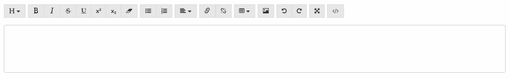
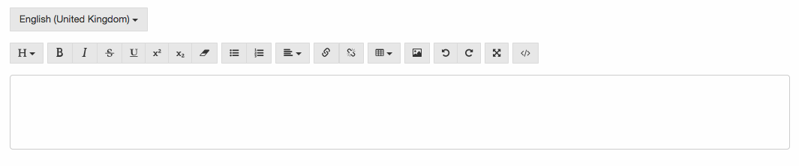

## [**HTML Editor**](./html-editor.md)

Sometimes you need to create or edit HTML on your application. Bennu Toolkit provides a interface to edit rich text. It outputs both a simple String or if needed a [Localized String](../localized-string/localized-string.md).


### Create
 To create a new HTML Editor you just create a textarea with a bennu-html-editor like this:

```javascript
<textarea bennu-html-editor id="post" name="post" rows="3"></textarea>
```

When rendered it will show as this:



You can configure the toolbar, choosing what should or not appear and in what order using the toolbar parameter like this:

```javascript
<textarea bennu-html-editor toolbar="size,style,lists,align,links,table,image,undo,fullscreen,source" id="post" name="post" rows="3"></textarea>
```

Here are the parameters that you can use to configure the toolbar. You can also set them in what ever order you like:

| **Controller** | **Description** | **Default** |
|:-:|:-:|:-:|
| size | Control the paragraph type, from headings to qoutes | true |
| style | Styles the text, like bold, italic, strikethrough, etc. | true |
| list | Makes bullets or numbered lists | true |
| align | Shows a dropdown that allows to align or justify text | true |
| links | Adding and removing links | true |
| table | Allows creating tables | true |
| colors | Allows foreground and background colouring | true |
| image | Adds support to adding images to the content | true |
| undo | Shows controllers for undo and redo | true |
| fullscreen | Enables fullscreen edition | true |
| source | Enables source code edition | true |


If you need to store a LocalizedString instead of a String you can create a HTML editor with support for LocalizedStrings. Just add a parameter bennu-localized-string to the textarea:

```javascript
<textarea bennu-html-editor bennu-localized-string id="post" name="post" rows="3"></textarea>
```

You'll get a interface similar to those of Localised Strings:



If you are using Angular you can can use the HTML editor by using the following:

```javascript
<textarea ng-html-editor="code" id="post" name="post" rows="3"></textarea>
```

### Editing
You can also use this controller to edit HTML. Supposing that you have a variable with the code called code:

```javascript
<textarea bennu-html-editor id="post" name="post" rows="3">${code}</textarea>
```
If you are using localized strings, just add the attribute, and pass the value as you would in a Localized String controller:

```javascript
<textarea bennu-html-editor bennu-localized-string id="post" name="post" rows="3">${code.json()}</textarea>
```
