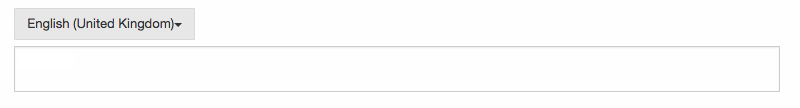

## [**Localized String**](./localized-string.md)
Bennu comes out of the box with support for localisation. This allows you to have interfaces written in multiple languages, and switch between them. 

However sometimes you need to save a string in multiple languages, and display the correct one. Bennu supports this with the [LocalizedString](https://github.com/FenixEdu/fenixedu-commons/blob/develop/src/main/java/org/fenixedu/commons/i18n/LocalizedString.java) object. The toolkit comes with controllers to create and edit these objects in HTML.

### Creating
If you wish to create a new LocalizedString object, just create a input field with the following code on your form:

```javascript
<input bennu-localized-string type="text" name="name" id="createSite" />
```
This should appear:


In the dropdown, the user can choose what language to edit. Internally the widget maintains the input field always updated, so when the user submits the form, all information is correct. If you are using Bennu Spring (and you should) you can get the LocalizedString object right on the request:

```javascript
@RequestMapping(value = "{slug}/edit", method = RequestMethod.POST)
public RedirectView edit(Model model, @PathVariable(value = "slug") String slug, @RequestParam LocalizedString name) {
```

If you are using a Angular, the code is a slightly different but works pretty much the same. The value you use in ng-localized-string is your Angular model:

```javascript
<input type="text" ng-localized-string="site.name"/>
```

If your user must fill all any or all languages you can use the tags required-any and required to prevent the form from being submitted:

```javascript
<input bennu-localized-string required-any type="text" name="name" id="name" />
```

This only works if you are placing your input inside a regular HTML form. If you are using the input field and doing some JavaScript code, you need to validate this on your own.

You can also use Localized Strings with textarea:

```javascript
<textarea bennu-localized-string required-any name="description"></textarea>
```

The following should appear:



It works just like the input field case. 


## Editing

If you need to edit a LocalizedString object, is as easy as creating, you just have to put the object contents in the attribute value like in any other HTML input field. For instance, supposing you have a name variable with a LocalizedString object:

```javascript
<input bennu-localized-string type="text" name="name" id="createSite" value='<c:out value="${name.json()}"/>' />
```

The method json will return a JSON into that value field. Internally the toolkit will parse that object, show the current value to the user, and maintain everything in sync.


Having parsing problems while using this controller? Are you using a Quote ( " ) instead of a Apostrophe ( ' ) ?

The json method returns a JSON object like this:

```javascript
{"en-US":"My Blog", "pt-PT":"O meu blog"}
```

If you use quotes to delimiter the value , it will clash with the quotes on the JSON object. Always use Aphostrophes with LocalizedString

