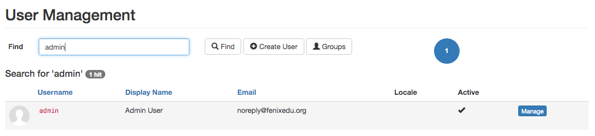
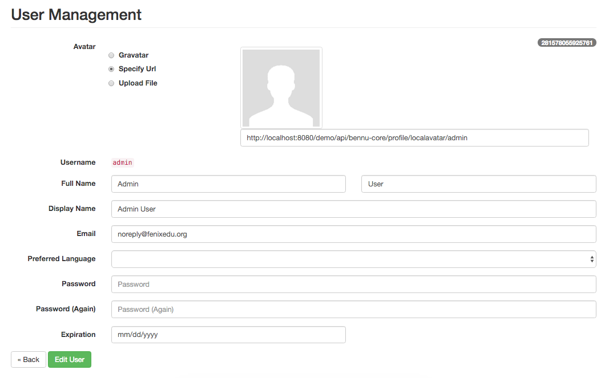
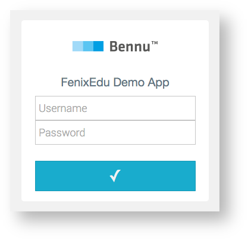

## [**Users and Security**](./users-and-security.md)

The Core Bennu Framework provides support for users and pluggable authentication mechanisms.

In an effort to keep the Framework generic, only basic information about the user is stored (such the user's name, login username, email address, preferred locale and account expiration date). Applications requiring extra information to be stored about a user, should create a new type of object, and connect it to the User instance

* Programmatic API
  + Mocking
* Requiring Login
* User Management
* Login Providers
* Local Login
  * CAS Provider
  * Rolling your own
  * Customizing the Login Page
* Authentication Listeners


## Programmatic API
Bennu provides an API to retrieve a reference to the currently logged user. It can be accessed by invoking the Authenticate.getUser() method. Alternatively, if you only need to check if the user is logged in, you can use the Authenticate.isLogged() method.

It is the responsability of the Login Providers and the Bennu infrastructure to ensure that the result of getUser() always corresponds to the user who logged in.

## Mocking
In some scenarios it may be necessary to "mock" the logged user (in custom tasks or other functionalities that require delegation, for instance).

To mock a user, you simply need to invoke the Authenticate.mock(User) method. This will ensure that every invocation to Authenticate.getUser() in the current request or custom task will return the mocked user. You can invoke Authenticate.unmock() when you're done, and if you want to clear the user before the request finishes.


## Requiring Login
It is common for a functionality to require a user to be logged in. If you have such a requirement, you can ask the user to log in, and come back to your functionality. Bennu provides a unified way to do this.

To ensure that the user is logged in when accessing your functionality, you may simply redirect the user to /login within your application, passing the the URL of your functionality as the callback query parameter. As an example, if your functionality is present at https://your.host/foo, you should perform a redirect to /login?callback=https%3A%2F%2Fyour.host%2Ffoo. Note that your callback URL should be properly escaped for use in a URL, and MUST be an absolute URL, always starting with your application's base URL. A common code for implementing this redirect could be (in Spring MVC):

```java
public String foo() {
  if (!Authenticate.isLogged()) {
    return "redirect:/" + CoreConfiguration.getConfiguration().applicationUrl() + "/foo";
  }
  return "bar";
}
```


After the login process is done, the user is redirected to the URL you provided, and one of two things may happen:

+ Authenticate.getUser() returns the logged user if the login was successful **OR**
+ The login attempt has failed (either due to some internal error of the provider, or because of the user being inactive), no user is returned, and the login_failed query parameter has been appended to your URL.


## User Management
Bennu Admin provides an interface to perform some basic management of the users registered in an application.


This interface allows searching for users in your application by their name or username, and lists all users that match the given search. To manage a single user, simply hit the 'Manage' button, which will show you the following interface:



This interface allows managing the user's basic data, such as the name, email and password.

## Login Providers
Bennu supports multiple backends for user authentication, allowing for a easy way to support new authentication mechanisms.

### Local Login
Bennu provides the necessary infrastructure for local username and password login. It is enabled by default, and can be disabled by setting the local.login property to false.

### CAS Provider
Using the CAS provider module, it is possible to login to your Bennu application using [CAS](https://www.apereo.org/projects/cas). To use CAS in your application, you must add the bennu-cas-client module.

```json
<dependency>
    <groupId>org.fenixedu</groupId>
    <artifactId>bennu-cas-client</artifactId>
    <version>${same-as-bennu}</version>
</dependency>
```

To enable the provider, you must specify the following properties:

```C
cas.enabled = true
cas.serverUrl = https://login.foo.bar/cas # The Base URL of the CAS server
cas.serviceUrl = http://localhost:8080/demo # The default CAS callback, if none is specified
```

### Rolling your own
To create your own login provider, you need to implement the LoginProvider interface, and on startup, register it using PortalLoginServlet.registerProvider(LoginProvider).

LoginProvider 's main method is invoked when the user chooses to log in with your provider. It may then present an interface to login, either by showing a custom page, or redirecting to another page.

When your provider determines the user that logged in, it must tell the infrastructure about it, invoking Authenticate.login(HttpServletRequest, HttpServletResponse, User). This will ensure that subsequent requests to the application from the same user are properly signaled.

### Customizing the Login Page
The login page can be customized, and is tied to the currently in use theme, falling back to the default layout.


In the example above, no other Login Providers are enabled. If they were, the user would see an option to use them instead of local login.

To customize this page, you need to provide a login.html file within your theme's folder. This file will be parsed by the Pebble Templating Engine. For reference on using Pebble, see the [Portal Themes](../portal/portal-themes/portal-themes.md) page. When the login page template is evaluated, the following variables are given to the context:
| Variable Name | Type                                                               | Description                                                                          |
|---------------|--------------------------------------------------------------------|--------------------------------------------------------------------------------------|
| callback      | java.lang.String                                                   | The URL for which to redirect the user upon successful login. May be null or empty.  |
| config        | org.fenixedu.bennu.portal.domain.PortalConfiguration               | The application's PortalConfiguration.                                               |
| contextPath   | java.lang.String                                                   | This request's context path. Useful to prefix absolute URLs.                         |
| currentLocale | java.util.Locale                                                   | The locale for the current user.                                                     |
| locales       | java.util.Set<java.util.Locale>                                    | The configured locales for this application.                                         |
| localLogin    | boolean                                                            | Whether local login is enabled.                                                      |
| providers     | java.utl.Collection<org.fenixedu.bennu.portal.login.LoginProvider> | The list of currently enabled providers.                                             |

The login screen must only present the username/password prompt if local login is enabled, and must present an error message if local login is disabled and there are no configured providers.

To forward the login to a provider, the user must submit a POST request to /login/<provider-key>, passing along the callback URL. This may be implemented using Forms and Submit buttons.

Note that if local login is disabled, and only one profile is active, the user is forwarded directly to the provider, and the login page is skipped.

## Authentication Listeners
It is possible to register a listener that is invoked whenever a user logs into the application, or explicitly logs out of it.

To register a new listener, simply implement UserAuthenticationListener, and register an instance of it using the Authenticate.addUserAuthenticationListener method.

Whenever a user logs in, the listener's onLogin(HttpServletRequest, HttpServletResponse, User) method is invoked, with the request that originated the login, its associated response, and the User that was just logged in.

Similarly, whenever a user explicitly logs out of the application, the onLogout(HttpServletRequest, HttpServletResponse, User) method is invoked. Note that however, a user may be logged out by other means, such as the associated session expiring.